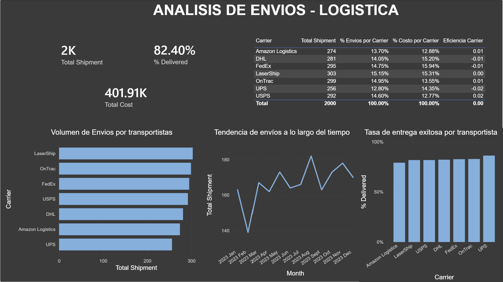

# 📦 Logistics Shipments Analysis | Análisis de Envíos - Logística

> Interactive Power BI dashboard analyzing shipment performance, costs, and carrier efficiency.
> Dashboard interactivo en Power BI para analizar el desempeño de envíos, costos y eficiencia de transportistas.

---

## 🇬🇧 English

### 📋 Project overview

Logistics analytics dashboard built in Power BI from a dataset of 2,000 shipments. The project covers the complete data analysis workflow: import, cleaning, modeling, DAX calculations, and visualization, aiming to answer key business questions about shipment performance.

### 🎯 Objective

Assess the operational performance of a shipping network to answer:
- What percentage of shipments are successfully delivered?
- How is volume distributed across carriers?
- Which carrier is most efficient in cost-to-volume terms?
- How does shipment volume evolve over time?

### 📊 Dataset

- **Source:** US Logistics Performance Dataset (Kaggle)
- **Records:** 2,000 shipments
- **Columns:** shipment ID, origin warehouse, destination, carrier, shipment & delivery dates, weight, cost, status, distance, and transit days
- **Note:** the dataset includes intentional missing values (~2% in cost and delivery date), handled as part of the analysis process

### 🛠️ Tools & techniques

- **Power BI Desktop** — modeling and visualization
- **Power Query (M language)** — data cleaning and transformation
- **DAX** — calculated measures
- **Data modeling** — calendar table and relationships

### ⚙️ Process

1. **Import & profiling** — load CSV and review data quality (Column Quality, Distribution, Profile)
2. **Transformation** — verify data types and create a conditional column (`Delivery Result`)
3. **Modeling** — `Calendar` table with `CALENDARAUTO()` and relationship to the shipments table
4. **DAX measures** — build key indicators
5. **Visualization** — single-page dashboard with KPIs and charts

### 🧮 DAX measures built

| Measure | Description |
|---------|-------------|
| `Total Shipment` | Total shipments (COUNTROWS) |
| `Total Cost` | Total shipping cost (SUM) |
| `% Delivered` | Successful delivery rate (CALCULATE + DIVIDE) |
| `% Envios por Carrier` | Shipment share by carrier (REMOVEFILTERS) |
| `% Costo por Carrier` | Cost share by carrier (REMOVEFILTERS) |
| `Eficiencia Carrier` | Difference between shipment share and cost share |

### 🔍 Key findings

- **82.4%** of shipments are delivered successfully; nearly 1 in 5 has an issue (delay, loss, or return).
- **Volume is evenly distributed** across the 7 carriers (none exceeds 15% or falls below 10%), indicating low dependency on any single provider.
- **Cost-to-volume efficiency is very similar** across carriers; differences are marginal (±2%), so a drastic carrier switch is not justified.
- Monthly shipment volume remains **stable throughout the year**, with no strong seasonality.

### 📸 Dashboard

> *(Replace `dashboard.png` with your dashboard screenshot)*

---

## 🇪🇸 Español

### 📋 Descripción del proyecto

Dashboard de análisis logístico construido en Power BI a partir de un dataset de 2,000 envíos. El proyecto recorre el flujo completo de un análisis de datos: importación, limpieza, modelado, cálculos con DAX y visualización, con el objetivo de responder preguntas clave de negocio sobre el desempeño de los envíos.

### 🎯 Objetivo

Evaluar el desempeño operativo de una red de envíos para responder:
- ¿Qué porcentaje de envíos se entrega con éxito?
- ¿Cómo se distribuye el volumen entre los transportistas?
- ¿Qué transportista es más eficiente en relación costo-volumen?
- ¿Cómo evoluciona el volumen de envíos a lo largo del tiempo?

### 📊 Dataset

- **Origen:** US Logistics Performance Dataset (Kaggle)
- **Registros:** 2,000 envíos
- **Columnas:** ID de envío, almacén de origen, destino, transportista, fechas de envío y entrega, peso, costo, estado, distancia y días de tránsito
- **Nota:** el dataset incluye valores faltantes intencionales (~2% en costo y fecha de entrega), tratados como parte del proceso de análisis

### 🛠️ Herramientas y técnicas

- **Power BI Desktop** — modelado y visualización
- **Power Query (lenguaje M)** — limpieza y transformación de datos
- **DAX** — medidas calculadas
- **Modelado** — tabla calendario y relaciones

### ⚙️ Proceso

1. **Importación y perfilado** — carga del CSV y revisión de calidad de datos (Column Quality, Distribution, Profile)
2. **Transformación** — verificación de tipos de dato y creación de columna condicional (`Delivery Result`)
3. **Modelado** — tabla `Calendar` con `CALENDARAUTO()` y relación con la tabla de envíos
4. **Medidas DAX** — construcción de indicadores clave
5. **Visualización** — dashboard de una página con KPIs y gráficos

### 🧮 Medidas DAX construidas

| Medida | Descripción |
|--------|-------------|
| `Total Shipment` | Total de envíos (COUNTROWS) |
| `Total Cost` | Costo total de envíos (SUM) |
| `% Delivered` | Porcentaje de entregas exitosas (CALCULATE + DIVIDE) |
| `% Envios por Carrier` | Cuota de envíos por transportista (REMOVEFILTERS) |
| `% Costo por Carrier` | Cuota de costo por transportista (REMOVEFILTERS) |
| `Eficiencia Carrier` | Diferencia entre cuota de envíos y de costo |

### 🔍 Hallazgos clave

- **82.4%** de los envíos se entregan con éxito; cerca de 1 de cada 5 presenta algún problema (retraso, pérdida o devolución).
- El **volumen está repartido de forma pareja** entre los 7 transportistas (ninguno supera el 15% ni baja del 10%), lo que indica baja dependencia de un solo proveedor.
- La **eficiencia costo-volumen es muy similar** entre transportistas; las diferencias son marginales (±2%), por lo que no se justifica un cambio drástico de proveedor.
- El volumen mensual de envíos se mantiene **estable a lo largo del año**, sin estacionalidad marcada.

### 📸 Dashboard

> *(Reemplaza `dashboard.png` con la captura de tu dashboard)*

---

## 👤 Autor | Author

**Jorge Rubén Velazquez Davila**

📜 Microsoft Data Analyst Professional Certificate (edX) · 2026

---

*Proyecto de portafolio · Portfolio project*
